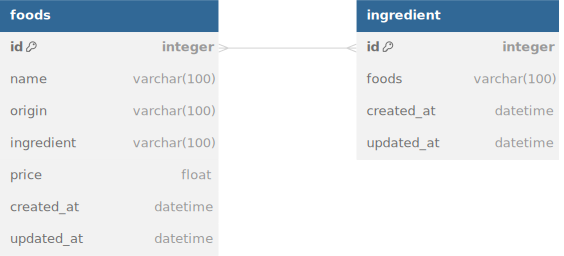

# Foods Backend REST API

## REST API Endpoints

- Local: `http://localhost:3000`

| Endpoint       | HTTP     | Description            |
| -------------- | -------- | ---------------------- |
| `/foods`       | `GET`    | Get all foods          |
| `/foods/:id`   | `GET`    | Get foods by id        |
| `/foods/:seed` | `POST`   | Seed all initial foods |
| `/foods`       | `POST`   | Add new foods          |
| `/foods`       | `DELETE` | Delete all foods       |
| `/foods/:id`   | `DELETE` | Delete foods by id     |
| `/foods/:id`   | `PUT`    | Update foods by id     |

## Database Design/Schema/ERD



## Getting Started

```sh
bun install
```

To run:

```sh
bun run dev
```

Open <http://localhost:3000>
